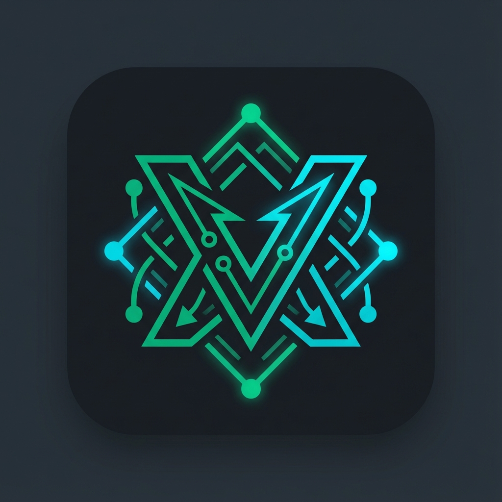

  
  <h1>V-Nexus</h1>
  

    <b>The Modern, High-Performance V2Ray Client for Windows</b>
  

  
  
  
  

---

**V-Nexus** is a next-generation GUI client for Xray Core, built on Electron and React. It is designed to provide a seamless, reliable, and aesthetically pleasing experience for users requiring censorship circumvention and secure tunneling on Windows.

> **Note**: This is the **V3 (Tauri + Rust)** branch. Huge performance upgrades over V2!

## Key Features

| Feature | Description |
| :--- | :--- |
| **Rust Backend** | High-performance, memory-safe backend powered by Tauri v2. |
| **Global Proxy (TUN)** | Route all system traffic (Games, Spotify, Discord) leak-proof firewall kill switch. |
| **Instant Connect** | Optimized polling engine ensures connection toggling is instant (<0.5s). |
| **Zero Bloat** | App size reduced significantly (vs Electron). |
| **Protocols** | Full support for **VMess**, **VLESS**, **Trojan**, and **Shadowsocks**. |
| **Monitoring** | Real-time traffic speed and server latency testing. |

## Download & Installation

1. Navigate to the **[Releases Page](https://github.com/zenyyxz/V-Nexus/releases)**.
2. Download the latest `V-Nexus Setup 3.0.0.exe`.
3. Run the installer.
    * *Note: You may see a SmartScreen warning as this is a community build. Click "Run Anyway" to proceed.*

## Quick Start

1. **Add Server**: Copy your `vmess://`, `vless://`, or subscription link.
2. **Paste**: Use the "Paste from Clipboard" button in the app.
3. **Connect**: Click the large central Connect button.
4. **Global Mode**: To route all traffic, go to Settings and enable **TUN Mode**.

## Technical Details

* **Core**: Xray-core (embedded)
* **Tech Stack**: Tauri v2, Rust, React, TypeScript, TailwindCSS
* **Routing**: Tun2Socks integration for system-wide routing

## Roadmap (V3)

Migration from Electron to Tauri is Complete.

* [x] V2 release (Legacy)
* [x] V3 Release (Rust/Tauri)

## Contributing

Contributions are welcome! Please submit a Pull Request or open an Issue if you find bugs.

## License

Distributed under the MIT License. See [LICENSE](LICENSE) for more information.

---

  Developed with by <a href="https://github.com/zenyyxz">Lahiru Rashmika</a>

